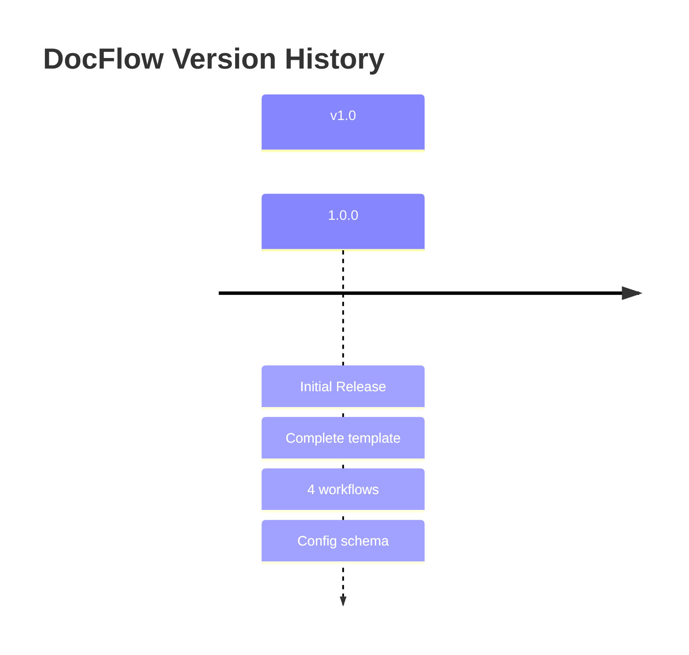

# Changelog

All notable changes to this project will be documented in this file.

The format is based on [Keep a Changelog](https://keepachangelog.com/en/1.0.0/),
and this project adheres to [Semantic Versioning](https://semver.org/spec/v2.0.0.html).

## [Unreleased]

### Added
- Initial DocFlow template structure
- Universal documentation generation workflow
- Comprehensive security scanning workflow
- Multi-language quality gates workflow
- Release management workflow with changelog generation
- CLAUDE.md template for AI assistants
- MASTER_STANDARD.md design specification template
- docflow.config.json configuration schema

### Workflows Included

| Workflow | Purpose |
|----------|---------|
| `docflow-generate-docs.yml` | Auto-generate documentation, diagrams, multi-format export |
| `docflow-security-scan.yml` | CodeQL, OWASP ZAP, dependency scanning, secret detection |
| `docflow-quality-gates.yml` | Multi-language linting, testing, naming conventions |
| `docflow-release.yml` | Semantic versioning, changelog, GitHub releases |

### Patterns Extracted From

- spotify-genre-sorter (staged deployment, maintenance mode)
- CIPP/CIPP-API (version-driven releases, changelog builder)
- uptime-kuma (multi-platform testing matrix)
- rustdesk (complex build matrices)
- PowerAppsCICDTemplate (OWASP ZAP, Teams notifications, Mermaid diagrams)
- PSAppDeployToolkit (PowerShell doc generation)

## [1.0.0] - {{DATE}}

### Added
- Initial release of DocFlow template
- Complete documentation and CI/CD pipeline setup
- Ready for use as GitHub template repository

---

## Version History Timeline

