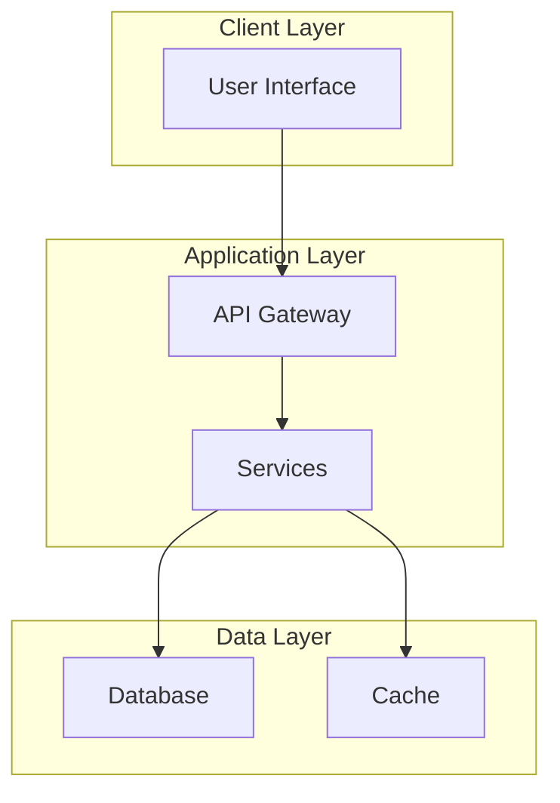

# CLAUDE.md

This file provides guidance to Claude Code (claude.ai/code) when working with code in this repository.

## Project Overview

**Project Name**: {{PROJECT_NAME}}
**Description**: {{PROJECT_DESCRIPTION}}
**Platform**: {{PLATFORM}} (Windows/Linux/macOS/Cross-platform)
**Language**: Australian English

## Quick Reference

| Item | Value |
|------|-------|
| Primary Language | {{PRIMARY_LANGUAGE}} |
| Framework | {{FRAMEWORK}} |
| Package Manager | {{PACKAGE_MANAGER}} |
| Test Framework | {{TEST_FRAMEWORK}} |
| CI/CD | GitHub Actions |

## Common Commands

### Development
```bash
# Install dependencies
{{INSTALL_COMMAND}}

# Run development server
{{DEV_COMMAND}}

# Run tests
{{TEST_COMMAND}}

# Build for production
{{BUILD_COMMAND}}

# Lint code
{{LINT_COMMAND}}
```

### Git Workflow
```bash
# Check status
git status

# Create feature branch
git checkout -b feature/your-feature-name

# Commit with conventional commits
git commit -m "feat: add new feature"
git commit -m "fix: resolve bug"
git commit -m "docs: update documentation"

# Push and create PR
git push -u origin feature/your-feature-name
```

### GitHub CLI
```bash
# Check workflow status
gh run list --limit 5
gh run view <run-id>

# Create release
gh release create v1.0.0 --generate-notes

# View PR
gh pr view <pr-number>
```

## Technical Standards

### Naming Conventions

| Type | Convention | Example |
|------|------------|---------|
| Files (components) | PascalCase | `UserProfile.tsx` |
| Files (utilities) | kebab-case | `format-date.ts` |
| Variables | camelCase | `userName` |
| Constants | SCREAMING_SNAKE_CASE | `MAX_RETRIES` |
| Functions | camelCase | `getUserData()` |
| Classes | PascalCase | `UserService` |
| Interfaces | PascalCase (I prefix optional) | `IUserProps` or `UserProps` |

### Folder Structure
```
.github/
  workflows/          # CI/CD pipelines
  ISSUE_TEMPLATE/     # Issue templates
  baselines/          # Regression test baselines
.design/              # Design specifications (source of truth)
docs/
  generated/          # Auto-generated documentation
src/                  # Source code
tests/                # Test files
scripts/              # Automation scripts
```

### Code Quality Standards

1. **Linting**: All code must pass linting before commit
2. **Testing**: Minimum 70% code coverage for new features
3. **Documentation**: All public APIs must be documented
4. **Security**: No hardcoded secrets, use environment variables
5. **Commits**: Use conventional commit format

### Conventional Commits
```
feat:     New feature
fix:      Bug fix
docs:     Documentation only
style:    Code style (formatting, semicolons, etc.)
refactor: Code refactoring
test:     Adding or updating tests
chore:    Maintenance tasks
perf:     Performance improvements
ci:       CI/CD changes
```

## Architecture



## Key Files to Read First

1. `README.md` - Project overview and quick start
2. `docflow.config.json` - Project configuration
3. `.design/MASTER_STANDARD.md` - Design standards (if exists)
4. `docs/ARCHITECTURE.md` - System architecture
5. `docs/DATA_DICTIONARY.md` - Data model reference

## Environment Variables

| Variable | Description | Required |
|----------|-------------|----------|
| `{{ENV_VAR_1}}` | {{DESCRIPTION}} | Yes/No |
| `{{ENV_VAR_2}}` | {{DESCRIPTION}} | Yes/No |

## Deployment Environments

| Environment | URL | Branch |
|-------------|-----|--------|
| Development | {{DEV_URL}} | `develop` |
| Staging | {{STAGING_URL}} | `staging` |
| Production | {{PROD_URL}} | `main` |

## Troubleshooting

### Common Issues

**Issue**: {{COMMON_ISSUE_1}}
**Solution**: {{SOLUTION_1}}

**Issue**: {{COMMON_ISSUE_2}}
**Solution**: {{SOLUTION_2}}

## Documentation Links

- [API Reference](docs/API_REFERENCE.md)
- [Data Dictionary](docs/DATA_DICTIONARY.md)
- [Deployment Guide](docs/DEPLOYMENT_GUIDE.md)
- [Contributing Guide](CONTRIBUTING.md)
