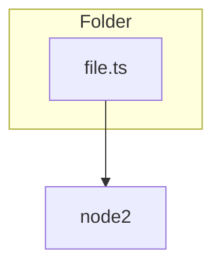
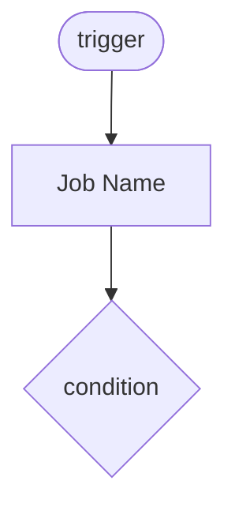

# Mermaid Diagram Generation Implementation

This document describes the Mermaid diagram generation feature added to DocFlow.

## Overview

Three new diagram generators have been implemented:

1. **ERD Generator** (`src/generators/erd.js`) - Entity Relationship Diagrams
2. **Dependency Graph Generator** (`src/generators/dependency-graph.js`) - Code dependencies
3. **Workflow Diagram Generator** (`src/generators/workflow-diagram.js`) - CI/CD workflows

## Files Created

```
src/
  generators/
    erd.js                      # ERD generator for Prisma, TypeORM, SQL
    dependency-graph.js         # Dependency graph from imports
    workflow-diagram.js         # GitHub Actions workflow diagrams
    index.js                    # Exports for all generators
    README.md                   # Comprehensive documentation

  cli/
    commands/
      generate.js               # Updated with 'diagrams' subcommand

examples/
  diagrams/
    sample-prisma-schema.prisma # Example Prisma schema
    sample-workflow.yml         # Example GitHub Actions workflow
    test-generators.js          # Test script
    USAGE_EXAMPLES.md           # Usage documentation
```

## Features Implemented

### 1. ERD Generator (`src/generators/erd.js`)

**Capabilities:**
- Parses Prisma schema files (`.prisma`)
- Parses TypeORM entity files (`*.entity.ts`)
- Parses SQL DDL files (`*.sql`)
- Auto-detects available schemas
- Generates Mermaid ERD syntax
- Identifies relationships (one-to-one, one-to-many, many-to-many)
- Marks primary keys (PK) and unique keys (UK)
- Handles optional fields and arrays

**Functions:**
- `generateERD(cwd, options)` - Auto-detect and generate all ERDs
- `generatePrismaERD(schemaPath)` - Parse Prisma schema
- `generateTypeORMERD(entitiesPath)` - Parse TypeORM entities
- `generateSQLERD(sqlPath)` - Parse SQL DDL
- `saveERD(result, outputPath, format)` - Save to file

### 2. Dependency Graph Generator (`src/generators/dependency-graph.js`)

**Capabilities:**
- Parses ES6 imports (`import ... from`)
- Parses CommonJS requires (`require()`)
- Parses dynamic imports (`import()`)
- Resolves relative and absolute paths
- Groups modules by folder (subgraphs)
- Detects circular dependencies
- Configurable depth limiting
- Filters external dependencies (node_modules)

**Functions:**
- `generateDependencyGraph(cwd, options)` - Generate full graph
- `generateMermaidDiagram(graph, options)` - Convert to Mermaid
- `detectCircularDependencies(graph)` - Find cycles
- `saveDependencyGraph(result, outputPath, format)` - Save to file

### 3. Workflow Diagram Generator (`src/generators/workflow-diagram.js`)

**Capabilities:**
- Parses GitHub Actions YAML workflows
- Extracts workflow name and triggers
- Identifies job dependencies (`needs`)
- Handles conditional jobs (`if`)
- Shows steps within jobs (limited to 5 for readability)
- Displays step conditions
- Color-codes nodes (jobs, steps, conditions)

**Functions:**
- `generateWorkflowDiagram(workflowPath)` - Parse single workflow
- `generateAllWorkflowDiagrams(cwd, options)` - Parse all workflows
- `saveWorkflowDiagrams(result, outputPath, format)` - Save to file

## CLI Usage

### Basic Commands

```bash
# Generate all diagram types
docflow generate diagrams

# Generate specific type
docflow generate diagrams --diagram-type erd
docflow generate diagrams --diagram-type dependencies
docflow generate diagrams --diagram-type workflows

# Custom output path
docflow generate diagrams -o docs/architecture.md

# Separate .mmd files
docflow generate diagrams --format separate
```

### Advanced Options

```bash
# Dependency graph with entry points
docflow generate diagrams --diagram-type dependencies \
  --entry src/index.ts src/app.ts \
  --max-depth 5

# All diagrams with custom output
docflow generate diagrams --diagram-type all \
  -o docs/diagrams/architecture.md \
  --format markdown
```

## Programmatic API

```javascript
import {
  generateERD,
  generateDependencyGraph,
  generateAllWorkflowDiagrams,
  saveERD,
  saveDependencyGraph,
  saveWorkflowDiagrams
} from '@tomstech/docflow/generators';

// Generate ERD
const erdResult = await generateERD('./project', {
  format: 'markdown',
  output: './docs/erd.md'
});
await saveERD(erdResult, './docs/erd.md');

// Generate dependency graph
const depResult = await generateDependencyGraph('./project', {
  entryPoints: ['src/index.ts'],
  maxDepth: 5,
  includeExternal: false
});
await saveDependencyGraph(depResult, './docs/dependencies.md');

// Generate workflow diagrams
const workflowResult = await generateAllWorkflowDiagrams('./project');
await saveWorkflowDiagrams(workflowResult, './docs/workflows.md');
```

## Output Formats

### Markdown (default)

Single markdown file with embedded Mermaid diagrams:

```markdown
# Entity Relationship Diagrams

> Auto-generated by DocFlow

## Prisma Schema

```mermaid
erDiagram
  User {
    int id PK "id"
    string email UK "email"
  }
  ...
```

## TypeORM Entities

```mermaid
erDiagram
  ...
```
```

### Separate Files

Individual `.mmd` files for each diagram:

```
docs/diagrams/
  erd-prisma.mmd
  erd-typeorm.mmd
  dependencies.mmd
  workflows-ci.mmd
  workflows-deploy.mmd
```

## Error Handling

All generators include comprehensive error handling:

- **File not found**: Clear error message with expected path
- **Parse errors**: Warning with file name and error details
- **No schemas found**: Graceful skip with informative message
- **Syntax errors**: Validation before generation

Example output:
```
✓ Configuration loaded
⠹ Generating Entity Relationship Diagram...
✓ Generated ERD (2 diagram(s))
⚠ Dependency graph generation skipped: No entry points found
✓ Generated Workflow Diagrams (3 workflow(s))
✓ Generation complete!
```

## Testing

### Manual Testing

Run the test script:
```bash
cd examples/diagrams
node test-generators.js
```

This tests:
1. Prisma ERD generation
2. Workflow diagram generation
3. File output

### Integration Testing

```bash
# Test in real project
cd /path/to/your/project
docflow generate diagrams
```

Check output in `docs/diagrams/`

## Examples

See `examples/diagrams/` for:
- `sample-prisma-schema.prisma` - Example Prisma schema
- `sample-workflow.yml` - Example GitHub Actions workflow
- `USAGE_EXAMPLES.md` - Detailed usage guide
- `test-generators.js` - Test script

## Technical Implementation

### Parser Patterns

**Prisma Schema**:
```regex
model\s+(\w+)\s*{([^}]+)}
```

**ES6 Imports**:
```regex
import\s+(?:(?:[\w*\s{},]*)\s+from\s+)?['"]([^'"]+)['"]
```

**CommonJS Requires**:
```regex
require\s*\(\s*['"]([^'"]+)['"]\s*\)
```

**GitHub Actions Jobs**:
```regex
^\s{2}([\w-]+):
```

### Mermaid Syntax

**ERD**:
```mermaid
erDiagram
  Entity {
    type fieldName KEY "label"
  }
  Entity1 ||--o{ Entity2 : "relationship"
```

**Dependency Graph**:


**Workflow**:


## Limitations

### Current Limitations

1. **ERD Generator**:
   - Prisma implicit relations may not be fully captured
   - TypeORM decorators must be on separate lines
   - SQL parser supports basic DDL only (MySQL, PostgreSQL, SQLite)

2. **Dependency Graph**:
   - Does not analyze dynamic import paths (variables)
   - May not resolve complex path aliases
   - Type-only imports are ignored
   - Limited to JavaScript/TypeScript

3. **Workflow Diagram**:
   - Only GitHub Actions (not GitLab CI, Jenkins)
   - Steps limited to 5 per job
   - Matrix strategies are simplified
   - Reusable workflows are not expanded

### Performance

- **ERD**: Fast (< 1s for 100 models)
- **Dependency Graph**: Moderate (1-5s for 1000 files)
- **Workflows**: Fast (< 1s for 10 workflows)

## Future Enhancements

Potential additions:
- [ ] GitLab CI/CD pipeline diagrams
- [ ] Azure DevOps pipeline diagrams
- [ ] Terraform resource graphs
- [ ] Docker Compose service diagrams
- [ ] Kubernetes architecture diagrams
- [ ] API endpoint diagrams from OpenAPI specs
- [ ] Sequelize model diagrams
- [ ] Mongoose schema diagrams
- [ ] State machine diagrams from XState

## Contributing

To add a new diagram generator:

1. Create `src/generators/my-diagram.js`
2. Implement generator and save functions
3. Export from `src/generators/index.js`
4. Add CLI option in `src/cli/commands/generate.js`
5. Add tests and examples
6. Update documentation

## Dependencies

No additional dependencies required. Uses existing DocFlow dependencies:
- `fs-extra` - File system operations
- `glob` - File pattern matching
- `path` - Path resolution

## Compatibility

- **Node.js**: >= 18 (ES modules)
- **Operating Systems**: Windows, macOS, Linux
- **Supported Languages**: JavaScript, TypeScript
- **Supported ORMs**: Prisma, TypeORM, Sequelize (future), Mongoose (future)
- **Supported CI/CD**: GitHub Actions (GitLab CI future)

## License

SEE LICENSE IN LICENSE

---

**Implementation Date**: 2025-12-08
**Author**: DocFlow Diagram Generators
**Version**: 1.0.0
