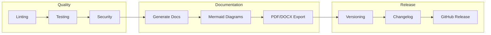

# DocFlow Template

> Universal Automatic Repo/Project Documentation Deployment Tool

[](https://github.com/{{OWNER}}/{{REPO}}/actions/workflows/docflow-quality-gates.yml)
[](https://github.com/{{OWNER}}/{{REPO}}/actions/workflows/docflow-security-scan.yml)
[](https://github.com/{{OWNER}}/{{REPO}}/actions/workflows/docflow-generate-docs.yml)
[](https://opensource.org/licenses/MIT)

## Overview

DocFlow is a comprehensive, best-in-class documentation and CI/CD template that ensures consistent, standardised project setup across all your repositories. It combines patterns from 24+ production repositories into a single, reusable template.



## Features

### Automated Documentation Generation
- README badges and statistics
- Mermaid architecture diagrams (ERD, flowcharts, state diagrams)
- Data dictionary from schemas
- Multi-format export (Markdown, PDF, DOCX)
- Auto-commit to repository

### Comprehensive Security Scanning
- **CodeQL**: Code vulnerability analysis
- **OWASP ZAP**: API and web security scanning (baseline, API, full)
- **Secret Detection**: Hardcoded credentials scanning
- **Dependency Scanning**: npm audit, Snyk integration

### Multi-Language Quality Gates
- **JavaScript/TypeScript**: ESLint, TypeScript type checking
- **Python**: Ruff (linting + formatting)
- **PowerShell**: PSScriptAnalyzer, syntax validation
- **YAML**: yamllint
- **Markdown**: markdownlint

### Release Management
- Semantic versioning automation
- Conventional commit changelog generation
- GitHub Release creation with artifacts
- Source archives (ZIP, TAR.GZ) with checksums
- Teams/Email notifications

### AI Integration
- CLAUDE.md template for AI assistants
- Auto-generated project context
- Key files reference

## Quick Start

### 1. Use as Template

```bash
# Option A: GitHub Template
gh repo create my-project --template your-org/docflow-template

# Option B: Clone and reinitialise
git clone https://github.com/your-org/docflow-template.git my-project
cd my-project
rm -rf .git
git init
```

### 2. Configure Your Project

Edit `docflow.config.json`:

```json
{
  "project": {
    "name": "My Project",
    "description": "My awesome project",
    "type": "auto",
    "language": "Australian English"
  }
}
```

### 3. Update CLAUDE.md

Replace the placeholder values in `CLAUDE.md` with your project details.

### 4. Push and Watch

```bash
git add .
git commit -m "feat: initial project setup"
git push -u origin main
```

The workflows will automatically:
- Run quality checks
- Generate documentation
- Create architecture diagrams

## Repository Structure

```
.
├── .github/
│   ├── workflows/              # CI/CD pipelines
│   │   ├── docflow-generate-docs.yml    # Documentation generation
│   │   ├── docflow-quality-gates.yml    # Linting, testing, coverage
│   │   ├── docflow-security-scan.yml    # Security scanning
│   │   └── docflow-release.yml          # Release management
│   ├── ISSUE_TEMPLATE/         # Issue templates
│   └── baselines/              # Regression test baselines
├── .design/                    # Design specifications
│   └── MASTER_STANDARD.md      # Unified standards document
├── docs/
│   └── generated/              # Auto-generated docs
├── scripts/                    # Automation scripts
├── src/                        # Source code
├── tests/                      # Test files
├── CLAUDE.md                   # AI assistant context
├── docflow.config.json         # DocFlow configuration
├── CHANGELOG.md                # Release history
├── CONTRIBUTING.md             # Contribution guidelines
├── LICENSE                     # MIT License
└── README.md                   # This file
```

## Workflows

| Workflow | Trigger | Purpose |
|----------|---------|---------|
| `docflow-generate-docs.yml` | Push, PR, Schedule, Manual | Generate documentation |
| `docflow-quality-gates.yml` | Push, PR, Manual | Run linting, tests, coverage |
| `docflow-security-scan.yml` | Push, PR, Schedule, Manual | Security scanning |
| `docflow-release.yml` | Tag push, Manual | Create releases |

## Configuration

### docflow.config.json Schema

```json
{
  "project": {
    "name": "string",
    "description": "string",
    "type": "auto | node | python | powershell | dotnet",
    "language": "Australian English | American English"
  },
  "branding": {
    "primary": "#hex",
    "secondary": "#hex"
  },
  "folders": {
    "enforce": true,
    "required": ["array"]
  },
  "diagrams": {
    "erd": { "enabled": true },
    "architecture": { "enabled": true }
  },
  "security": {
    "owaspZap": { "enabled": true },
    "secretScanning": { "enabled": true }
  },
  "linting": {
    "enabled": true,
    "languages": {}
  },
  "releases": {
    "enabled": true,
    "versioning": { "strategy": "semver" }
  }
}
```

## Required Secrets

| Secret | Description | Required |
|--------|-------------|----------|
| `GITHUB_TOKEN` | Auto-provided by GitHub | Yes (auto) |
| `TEAMS_WEBHOOK_URL` | Microsoft Teams webhook for notifications | Optional |
| `PORTAL_URL` | Target URL for OWASP ZAP scanning | Optional |
| `API_URL` | API endpoint for security scanning | Optional |

## Customisation

### Adding Custom Workflows

1. Create new workflow in `.github/workflows/`
2. Follow naming convention: `docflow-{purpose}.yml`
3. Use reusable patterns from existing workflows

### Custom Documentation Templates

1. Add templates to `.design/templates/`
2. Reference in `docflow.config.json`
3. Workflows will use custom templates

### Custom Linting Rules

1. Create config files (`.eslintrc.json`, `pyproject.toml`, etc.)
2. Workflows auto-detect and use them

## Best Practices Implemented

This template incorporates best practices from:

| Source | Patterns Extracted |
|--------|-------------------|
| **spotify-genre-sorter** | Staged deployment, maintenance mode, DNS management |
| **CIPP/CIPP-API** | Version-driven releases, changelog builder |
| **uptime-kuma** | Multi-platform testing matrix |
| **rustdesk** | Complex build matrices, artifact handling |
| **PowerAppsCICDTemplate** | OWASP ZAP, Teams notifications, Mermaid diagrams |
| **PSAppDeployToolkit** | PowerShell doc generation, cross-repo commits |

## Contributing

1. Fork the repository
2. Create feature branch (`git checkout -b feature/amazing-feature`)
3. Commit changes (`git commit -m 'feat: add amazing feature'`)
4. Push to branch (`git push origin feature/amazing-feature`)
5. Open Pull Request

## License

This project is licensed under the MIT License - see the [LICENSE](LICENSE) file for details.

## Acknowledgements

- All patterns extracted from production repositories
- [GitHub Actions](https://github.com/features/actions)
- [OWASP ZAP](https://www.zaproxy.org/)
- [Mermaid](https://mermaid.js.org/)
- [Pandoc](https://pandoc.org/)
