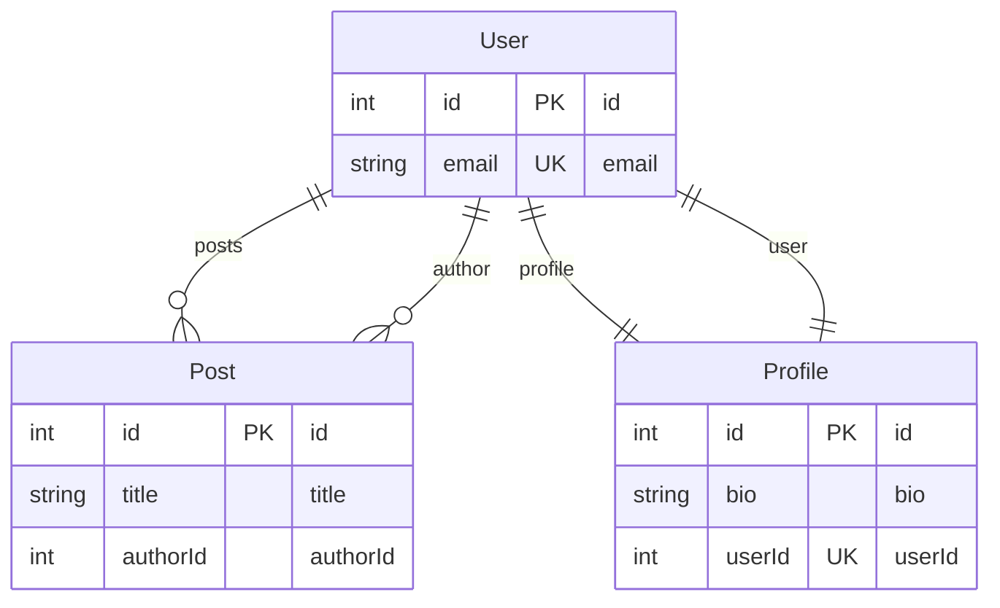
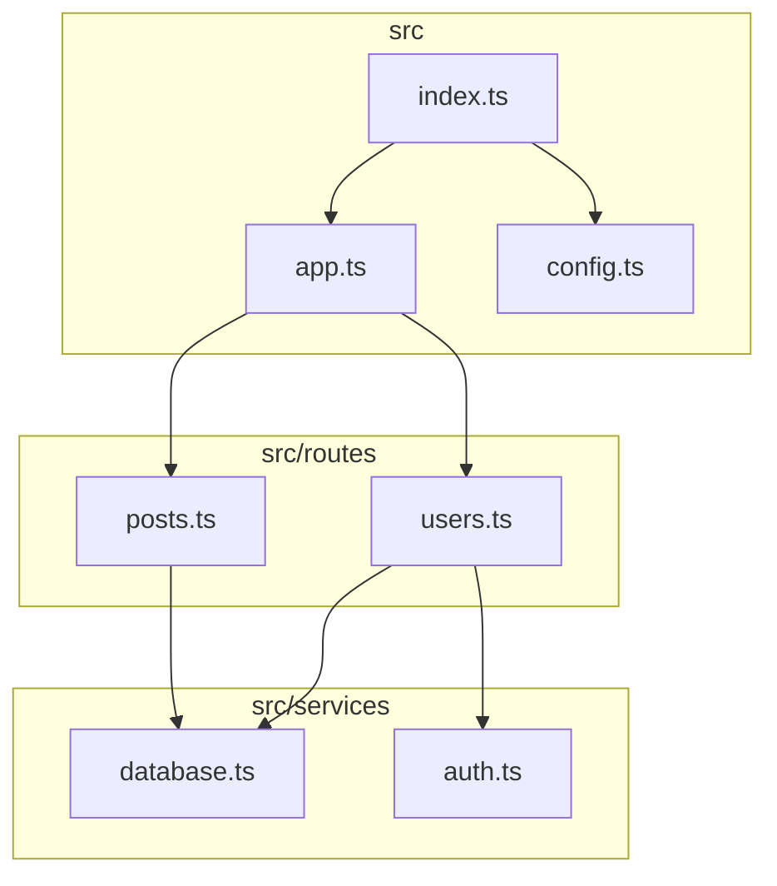
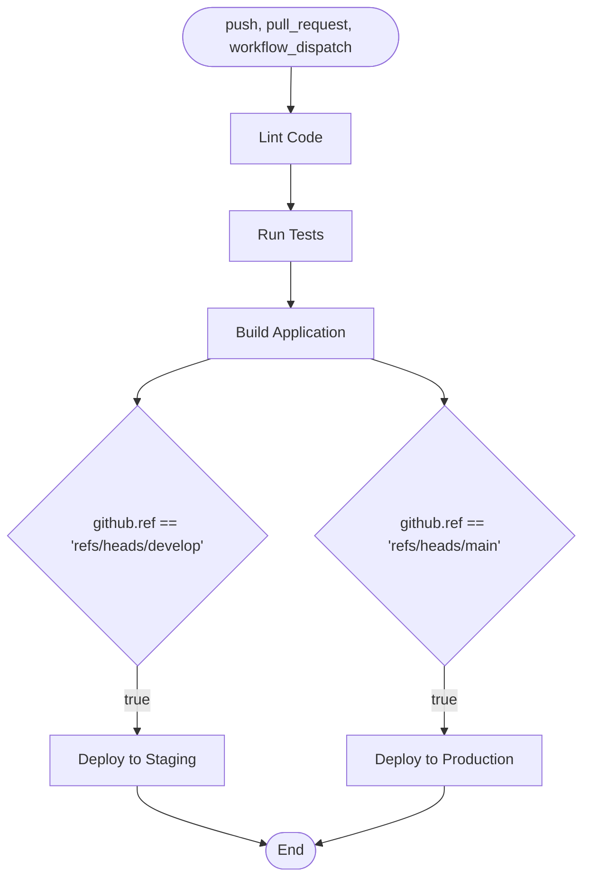

# DocFlow Diagram Generator Usage Examples

This directory contains examples of using the DocFlow diagram generators.

## Quick Start

### 1. Generate All Diagrams

```bash
cd /path/to/your/project
docflow generate diagrams
```

This will create:
- `docs/diagrams/erd.md` - Entity Relationship Diagrams
- `docs/diagrams/dependencies.md` - Module Dependency Graph
- `docs/diagrams/workflows.md` - GitHub Actions Workflow Diagrams

### 2. Generate Specific Diagram Types

#### ERD Only
```bash
docflow generate diagrams --diagram-type erd
```

Supports:
- **Prisma** - Automatically finds `prisma/schema.prisma`
- **TypeORM** - Scans `src/entities/**/*.entity.{ts,js}`
- **SQL** - Parses `**/*.sql` DDL files

#### Dependency Graph Only
```bash
docflow generate diagrams --diagram-type dependencies
```

Options:
```bash
# Specify entry points
docflow generate diagrams --diagram-type dependencies \
  --entry src/index.ts src/app.ts

# Limit graph depth
docflow generate diagrams --diagram-type dependencies --max-depth 3
```

#### Workflows Only
```bash
docflow generate diagrams --diagram-type workflows
```

Automatically scans `.github/workflows/*.yml`

### 3. Custom Output Paths

```bash
# Single custom file
docflow generate diagrams -o architecture.md

# Custom directory
docflow generate diagrams -o docs/architecture/diagrams.md
```

### 4. Output Formats

#### Markdown (default)
Single markdown file with embedded Mermaid diagrams:
```bash
docflow generate diagrams --format markdown
```

Output:
```markdown
# Entity Relationship Diagrams

## Prisma Schema

```mermaid
erDiagram
  ...
```
```

#### Separate Files
Individual `.mmd` files for each diagram:
```bash
docflow generate diagrams --format separate
```

Output:
```
docs/diagrams/
  erd-prisma.mmd
  erd-typeorm.mmd
  dependencies.mmd
  workflows-ci.mmd
  workflows-deploy.mmd
```

## Example Outputs

### Prisma ERD

Given `sample-prisma-schema.prisma`:

```prisma
model User {
  id        Int       @id @default(autoincrement())
  email     String    @unique
  posts     Post[]
  profile   Profile?
}

model Post {
  id        Int      @id @default(autoincrement())
  title     String
  author    User     @relation(fields: [authorId], references: [id])
  authorId  Int
}

model Profile {
  id     Int    @id @default(autoincrement())
  bio    String
  user   User   @relation(fields: [userId], references: [id])
  userId Int    @unique
}
```

Generates:



### Dependency Graph

Given this file structure:
```
src/
  index.ts
  app.ts
  routes/
    users.ts
    posts.ts
  services/
    database.ts
    auth.ts
```

With these imports:
```typescript
// src/index.ts
import { app } from './app';
import { config } from './config';

// src/app.ts
import { userRouter } from './routes/users';
import { postRouter } from './routes/posts';

// src/routes/users.ts
import { database } from '../services/database';
import { auth } from '../services/auth';

// src/routes/posts.ts
import { database } from '../services/database';
```

Generates:



### GitHub Actions Workflow

Given `sample-workflow.yml`, generates a flowchart showing:
- Triggers (push, pull_request)
- Job dependencies (lint → test → build → deploy)
- Conditional deployments (staging vs production)
- Steps within each job



## Advanced Examples

### 1. Multi-Schema ERD

If your project has multiple ORMs:
```bash
docflow generate diagrams --diagram-type erd
```

Output includes all detected schemas:
- Prisma schema
- TypeORM entities
- SQL DDL files

### 2. Filtered Dependency Graph

Only include specific modules:
```bash
docflow generate diagrams --diagram-type dependencies \
  --entry src/api/index.ts \
  --max-depth 3
```

### 3. Circular Dependency Detection

The dependency graph automatically detects circular dependencies:

```markdown
## ⚠️ Circular Dependencies Detected

1. src/services/user.ts → src/services/auth.ts → src/services/user.ts
2. src/models/post.ts → src/models/comment.ts → src/models/post.ts
```

### 4. Multi-Workflow Diagrams

Generate diagrams for all workflows:
```bash
docflow generate diagrams --diagram-type workflows
```

Creates one diagram per workflow file:
- `ci.yml` → CI Pipeline diagram
- `deploy.yml` → Deployment diagram
- `release.yml` → Release workflow diagram

## Integration with CI/CD

### Generate Diagrams on Push

Add to `.github/workflows/docs.yml`:

```yaml
name: Generate Documentation

on:
  push:
    branches: [main]
    paths:
      - 'prisma/**'
      - 'src/**'
      - '.github/workflows/**'

jobs:
  generate-diagrams:
    runs-on: ubuntu-latest
    steps:
      - uses: actions/checkout@v4

      - name: Setup Node.js
        uses: actions/setup-node@v4
        with:
          node-version: '18'

      - name: Install DocFlow
        run: npm install -g @tomstech/docflow

      - name: Generate diagrams
        run: docflow generate diagrams

      - name: Commit changes
        run: |
          git config user.name "github-actions[bot]"
          git config user.email "github-actions[bot]@users.noreply.github.com"
          git add docs/diagrams/
          git commit -m "docs: update generated diagrams [skip ci]" || echo "No changes"
          git push
```

### Pre-commit Hook

Add to `.husky/pre-commit`:

```bash
#!/bin/sh
. "$(dirname "$0")/_/husky.sh"

# Regenerate diagrams if schema changed
if git diff --cached --name-only | grep -E '(prisma/|src/entities/)'; then
  echo "Schema changed, regenerating diagrams..."
  npx docflow generate diagrams --diagram-type erd
  git add docs/diagrams/
fi
```

## Troubleshooting

### No Diagrams Generated

**Problem**: All diagram types are skipped
**Solution**: Ensure your project has supported files:
- Prisma: `prisma/schema.prisma`
- TypeORM: `src/entities/*.entity.ts`
- SQL: `*.sql` files
- Workflows: `.github/workflows/*.yml`

### Parse Errors

**Problem**: "Failed to parse workflow"
**Solution**:
- Validate YAML syntax: `yamllint .github/workflows/ci.yml`
- Ensure proper indentation (2 spaces)
- Check for unsupported YAML features

### Missing Dependencies

**Problem**: Some imports not shown in graph
**Solution**:
- Check path aliases in `tsconfig.json`
- Ensure entry points are specified correctly
- Increase `--max-depth` if needed

### Large Diagrams

**Problem**: Diagram is too complex/cluttered
**Solution**:
- Use `--max-depth` to limit scope
- Generate separate diagrams per module
- Use `--format separate` for better readability

## Best Practices

### 1. Organize Diagrams
```
docs/
  diagrams/
    database/
      schema.md
      migrations.md
    architecture/
      dependencies.md
      workflows.md
```

### 2. Update Regularly
```bash
# Add to package.json scripts
{
  "scripts": {
    "docs:diagrams": "docflow generate diagrams",
    "docs:all": "npm run docs:diagrams && docflow generate claude"
  }
}
```

### 3. Version Control
```gitignore
# .gitignore
# Only commit generated diagrams if they're useful for code review
# Otherwise, generate on-demand or in CI

# Option 1: Commit diagrams
docs/diagrams/*.md

# Option 2: Ignore and generate in CI
docs/diagrams/
```

### 4. Documentation Links

Reference diagrams in your README:

```markdown
## Architecture

- [Database Schema](docs/diagrams/erd.md)
- [Module Dependencies](docs/diagrams/dependencies.md)
- [CI/CD Pipeline](docs/diagrams/workflows.md)
```

## See Also

- [Main README](../../README.md)
- [Generator Documentation](../../src/generators/README.md)
- [Mermaid Documentation](https://mermaid.js.org/)
