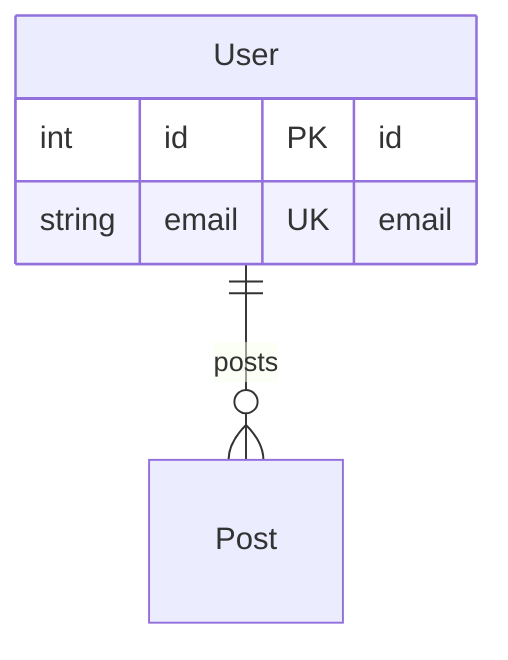
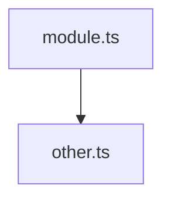
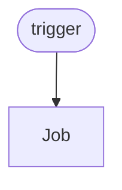

# Diagram Generators Quick Reference

## Commands

```bash
# Generate all diagrams
docflow generate diagrams

# Specific diagram types
docflow generate diagrams --diagram-type erd
docflow generate diagrams --diagram-type dependencies
docflow generate diagrams --diagram-type workflows

# Custom output
docflow generate diagrams -o path/to/output.md

# Separate .mmd files
docflow generate diagrams --format separate

# Dependency graph options
docflow generate diagrams --diagram-type dependencies \
  --entry src/index.ts \
  --max-depth 5
```

## Supported Schemas

| Type | Files | Location |
|------|-------|----------|
| **Prisma** | `schema.prisma` | `prisma/` |
| **TypeORM** | `*.entity.{ts,js}` | `src/entities/` |
| **SQL** | `*.sql` | Root or subdirs |
| **Workflows** | `*.yml` | `.github/workflows/` |
| **Dependencies** | `*.{js,ts,jsx,tsx}` | Auto-detected |

## Output Files

Default locations:
```
docs/
  diagrams/
    erd.md              # Entity relationship diagrams
    dependencies.md     # Module dependency graph
    workflows.md        # CI/CD workflow diagrams
```

## API

```javascript
import {
  generateERD,
  generateDependencyGraph,
  generateAllWorkflowDiagrams
} from '@tomstech/docflow/generators';

// ERD
const erd = await generateERD('./path');
await saveERD(erd, './output.md');

// Dependencies
const deps = await generateDependencyGraph('./path', {
  entryPoints: ['src/index.ts'],
  maxDepth: 5
});
await saveDependencyGraph(deps, './output.md');

// Workflows
const workflows = await generateAllWorkflowDiagrams('./path');
await saveWorkflowDiagrams(workflows, './output.md');
```

## Mermaid Syntax

### ERD


### Dependency Graph


### Workflow


## Common Options

| Option | Values | Default | Description |
|--------|--------|---------|-------------|
| `--diagram-type` | `erd`, `dependencies`, `workflows`, `all` | `all` | Diagram type to generate |
| `--format` | `markdown`, `separate` | `markdown` | Output format |
| `--output`, `-o` | Path | `docs/diagrams/*.md` | Output file path |
| `--entry` | File paths | Auto-detected | Entry points for dependencies |
| `--max-depth` | Number | `5` | Max depth for dependency graph |
| `--force`, `-f` | Boolean | `false` | Overwrite existing files |

## Examples

### Full Stack Project
```bash
# Generate all diagrams for Node.js + Prisma project
docflow generate diagrams

# Output:
# - ERD from Prisma schema
# - Dependency graph from src/
# - Workflow diagrams from .github/workflows/
```

### API Only
```bash
# Focus on API dependencies
docflow generate diagrams --diagram-type dependencies \
  --entry src/api/index.ts \
  --max-depth 3
```

### CI/CD Only
```bash
# Just workflow diagrams
docflow generate diagrams --diagram-type workflows
```

## Troubleshooting

| Issue | Solution |
|-------|----------|
| No diagrams generated | Check if supported files exist |
| Parse error | Validate YAML/schema syntax |
| Missing dependencies | Specify `--entry` points |
| Diagram too large | Reduce `--max-depth` |
| File not found | Check file path and permissions |

## Files Created

```
src/generators/
  erd.js                    # ERD generator (12 KB)
  dependency-graph.js       # Dependency graph (12 KB)
  workflow-diagram.js       # Workflow diagrams (14 KB)
  index.js                  # Exports (0.5 KB)
  README.md                 # Full documentation (13 KB)
  QUICK_REFERENCE.md        # This file (3 KB)

examples/diagrams/
  sample-prisma-schema.prisma   # Example schema
  sample-workflow.yml           # Example workflow
  test-generators.js            # Test script
  USAGE_EXAMPLES.md             # Usage guide (10 KB)
```

## Resources

- [Full Documentation](./README.md)
- [Usage Examples](../../examples/diagrams/USAGE_EXAMPLES.md)
- [Mermaid Docs](https://mermaid.js.org/)
- [DocFlow Main](../../README.md)
