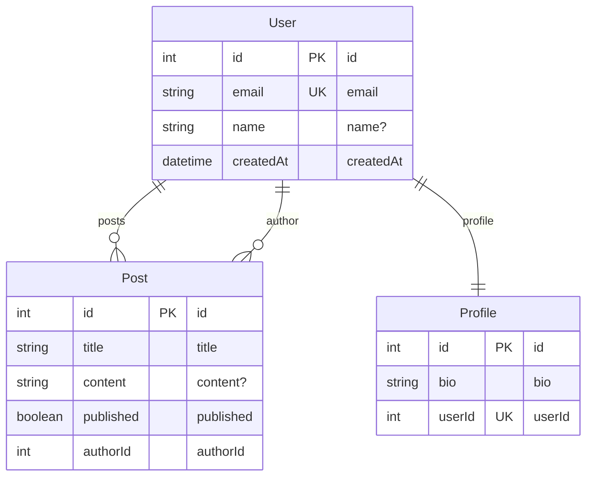
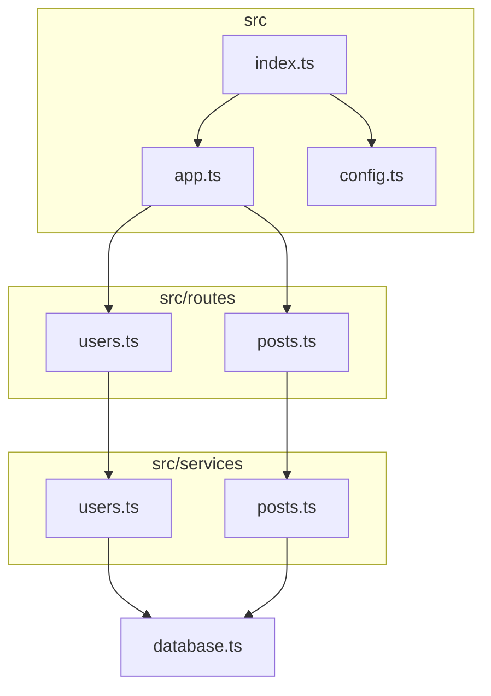
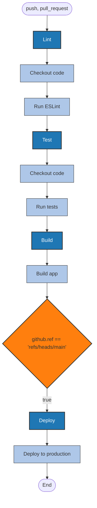

# DocFlow Diagram Generators

Automated Mermaid diagram generation for visualizing database schemas, code dependencies, and CI/CD workflows.

## Overview

The DocFlow diagram generators automatically create Mermaid diagrams from your codebase:

- **ERD Generator** - Entity Relationship Diagrams from Prisma, TypeORM, or SQL schemas
- **Dependency Graph Generator** - Module dependency graphs from import statements
- **Workflow Diagram Generator** - Flowcharts from GitHub Actions YAML files

## Installation

Generators are included with DocFlow. No additional installation required.

## Usage

### Command Line

Generate all diagrams:
```bash
docflow generate diagrams
```

Generate specific diagram types:
```bash
# ERD only
docflow generate diagrams --diagram-type erd

# Dependency graph only
docflow generate diagrams --diagram-type dependencies

# Workflows only
docflow generate diagrams --diagram-type workflows
```

Advanced options:
```bash
# Custom output path
docflow generate diagrams -o docs/architecture.md

# Separate .mmd files instead of markdown
docflow generate diagrams --format separate

# Dependency graph with custom entry points
docflow generate diagrams --diagram-type dependencies --entry src/index.ts src/app.ts

# Limit dependency depth
docflow generate diagrams --diagram-type dependencies --max-depth 3
```

### Programmatic API

```javascript
import {
  generateERD,
  generateDependencyGraph,
  generateAllWorkflowDiagrams
} from '@tomstech/docflow/generators';

// Generate ERD
const erdResult = await generateERD('./path/to/project');
await saveERD(erdResult, './docs/erd.md');

// Generate dependency graph
const depResult = await generateDependencyGraph('./path/to/project', {
  entryPoints: ['src/index.ts'],
  maxDepth: 5
});
await saveDependencyGraph(depResult, './docs/dependencies.md');

// Generate workflow diagrams
const workflowResult = await generateAllWorkflowDiagrams('./path/to/project');
await saveWorkflowDiagrams(workflowResult, './docs/workflows.md');
```

## ERD Generator

### Supported Schemas

#### Prisma
Automatically detects and parses `prisma/schema.prisma`:

```prisma
model User {
  id        Int      @id @default(autoincrement())
  email     String   @unique
  name      String?
  posts     Post[]
  profile   Profile?
  createdAt DateTime @default(now())
}

model Post {
  id        Int      @id @default(autoincrement())
  title     String
  content   String?
  published Boolean  @default(false)
  author    User     @relation(fields: [authorId], references: [id])
  authorId  Int
}

model Profile {
  id     Int    @id @default(autoincrement())
  bio    String
  user   User   @relation(fields: [userId], references: [id])
  userId Int    @unique
}
```

Generates:


#### TypeORM
Scans `src/entities/` for `*.entity.ts` files:

```typescript
import { Entity, PrimaryGeneratedColumn, Column, OneToMany } from 'typeorm';

@Entity()
export class User {
  @PrimaryGeneratedColumn()
  id: number;

  @Column({ unique: true })
  email: string;

  @Column({ nullable: true })
  name?: string;

  @OneToMany(() => Post, post => post.author)
  posts: Post[];
}

@Entity()
export class Post {
  @PrimaryGeneratedColumn()
  id: number;

  @Column()
  title: string;

  @ManyToOne(() => User, user => user.posts)
  author: User;
}
```

#### SQL DDL
Parses `CREATE TABLE` statements from `.sql` files:

```sql
CREATE TABLE users (
  id INT PRIMARY KEY AUTO_INCREMENT,
  email VARCHAR(255) UNIQUE NOT NULL,
  name VARCHAR(255),
  created_at TIMESTAMP DEFAULT CURRENT_TIMESTAMP
);

CREATE TABLE posts (
  id INT PRIMARY KEY AUTO_INCREMENT,
  title VARCHAR(255) NOT NULL,
  content TEXT,
  author_id INT NOT NULL,
  FOREIGN KEY (author_id) REFERENCES users(id)
);
```

### Output Formats

#### Markdown (default)
Single `.md` file with embedded Mermaid diagrams:
```markdown
# Entity Relationship Diagrams

> Auto-generated by DocFlow

## Prisma Schema

```mermaid
erDiagram
  ...
```
```

#### Separate Files
Individual `.mmd` files for each diagram:
```
docs/
  diagrams/
    erd-prisma.mmd
    erd-typeorm.mmd
```

## Dependency Graph Generator

Analyzes JavaScript/TypeScript import statements to build module dependency graphs.

### Features

- Detects ES6 imports, CommonJS requires, and dynamic imports
- Resolves relative and absolute paths
- Identifies circular dependencies
- Filters external (node_modules) dependencies
- Groups modules by folder
- Configurable depth limiting

### Example

Given this code structure:
```
src/
  index.ts          -> imports app.ts, config.ts
  app.ts            -> imports routes/*, services/*
  config.ts         -> imports utils/env.ts
  routes/
    users.ts        -> imports services/users.ts
    posts.ts        -> imports services/posts.ts
  services/
    users.ts        -> imports database.ts
    posts.ts        -> imports database.ts
  database.ts
```

Generates:


### Circular Dependency Detection

If circular dependencies are detected, they are reported:

```markdown
## ⚠️ Circular Dependencies Detected

The following circular dependencies were found:

1. src/services/users.ts → src/services/auth.ts → src/services/users.ts
2. src/models/user.ts → src/models/post.ts → src/models/user.ts
```

## Workflow Diagram Generator

Parses GitHub Actions YAML files to create workflow flowcharts.

### Features

- Parses job dependencies (`needs`)
- Shows conditional jobs and steps (`if`)
- Displays workflow triggers
- Groups steps within jobs
- Styles by node type (job, step, condition)

### Example

GitHub Actions workflow:
```yaml
name: CI/CD Pipeline

on:
  push:
    branches: [main]
  pull_request:

jobs:
  lint:
    runs-on: ubuntu-latest
    steps:
      - name: Checkout code
        uses: actions/checkout@v4
      - name: Run ESLint
        run: npm run lint

  test:
    runs-on: ubuntu-latest
    needs: lint
    steps:
      - name: Checkout code
        uses: actions/checkout@v4
      - name: Run tests
        run: npm test

  build:
    runs-on: ubuntu-latest
    needs: test
    steps:
      - name: Build app
        run: npm run build

  deploy:
    runs-on: ubuntu-latest
    needs: build
    if: github.ref == 'refs/heads/main'
    steps:
      - name: Deploy to production
        run: ./deploy.sh
```

Generates:


## Output Locations

Default output paths:
```
docs/
  diagrams/
    erd.md              # Entity relationship diagrams
    dependencies.md     # Dependency graphs
    workflows.md        # Workflow flowcharts
```

Custom output:
```bash
docflow generate diagrams -o my-docs/architecture.md
```

## Integration with CLAUDE.md

Add diagram generation to your documentation workflow:

```bash
# Generate diagrams before creating CLAUDE.md
docflow generate diagrams
docflow generate claude
```

Reference diagrams in CLAUDE.md:
```markdown
## Architecture

See [Architecture Diagrams](docs/diagrams/erd.md) for database schema.
See [Dependencies](docs/diagrams/dependencies.md) for module relationships.
See [CI/CD Workflows](docs/diagrams/workflows.md) for deployment pipeline.
```

## Limitations

### ERD Generator
- Prisma: Implicit relations may not be fully captured
- TypeORM: Decorators must be on separate lines
- SQL: Only supports basic DDL syntax (MySQL, PostgreSQL, SQLite)

### Dependency Graph
- Does not analyze dynamic import paths (variables)
- May not resolve complex path aliases without tsconfig
- Ignores type-only imports
- Limited to JavaScript/TypeScript

### Workflow Diagram
- Only supports GitHub Actions (not GitLab CI, Jenkins, etc.)
- Steps are limited to 5 per job for readability
- Complex matrix strategies are simplified
- Reusable workflows are not expanded

## Roadmap

- [ ] GitLab CI/CD pipeline diagrams
- [ ] Azure DevOps pipeline diagrams
- [ ] Terraform resource graphs
- [ ] Docker Compose service diagrams
- [ ] Kubernetes architecture diagrams
- [ ] API endpoint diagrams from OpenAPI specs
- [ ] State machine diagrams from XState

## Examples

See `examples/diagrams/` for sample outputs:
- `examples/diagrams/prisma-erd.md` - Blog schema
- `examples/diagrams/dependencies.md` - Express API
- `examples/diagrams/workflows.md` - CI/CD pipeline

## Contributing

To add a new diagram generator:

1. Create `src/generators/my-diagram.js`
2. Export generator and save functions
3. Add to `src/generators/index.js`
4. Update `src/cli/commands/generate.js`
5. Add tests and documentation

## License

SEE LICENSE IN LICENSE
